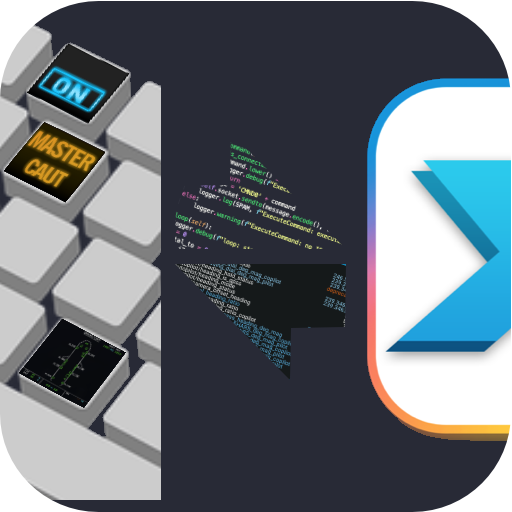

# Welcome to Cockpit Deck

Cockpitdecks is a python software to interface

- Elgato Stream Decks
- Loupedeck LoupedeckLive
- Behringer XTouch Mini

with X-Plane flight simulator.

The project is in active development.

Please head to the [wiki](https://github.com/devleaks/cockpitdecks/wiki) for more information.




# Installation

## Libhidapi

There must be a HIDAPI library on your system, Elgato Streamdeck python package requires it.

On MacOS, use

```
$ brew install libhidapi
```

### Make libhidapi known from python

Make sure the path where the library is installed into is accessible to dlopen(3)
or whatever call your version of Python uses to locate the library.

```
export DYLD_LIBRARY_PATH=/opt/homebrew/lib
```
(Latest versions of Streamdeck tries to locate the library if installed through `brew`)


## Global packages required by Cockpitdecks

```
$ pip install ruamel.yaml pillow
```

If you want to use the Metar/Weather representation on a key, please add:

```
$ pip install timezonefinder suntime 'avwx-engine[scipy]' tabulate
```

Cockpitdecks will automagically discover the presence of those packages and make weather keys available to cockpit designers.


## Packages required depending on the deck(s) model(s) used

### Elgato Streamdeck

```
$ pip install streamdeck
```

### Loupedeck LoupedeckLive

```
$ pip install git+https://github.com/devleaks/python-loupedeck-live.git
```

### Beringher X Touch Mini

```
$ pip install git+https://github.com/devleaks/python-berhinger-xtouchmini.git
```

## Create or Copy Configuration Files

If you copy from the provided files:

```
$ cp -rp A321/deckconfig /path/to/your/aircraft/folder
```

## Start

```
$ python bin/cockpitdecks_upd_start.py /path/to/your/aircraft/folder
```

Alternatively, you can use the provided files directly:

```
$ python bin/cockpitdecks_upd_start.py A321
```

Fly safely.
