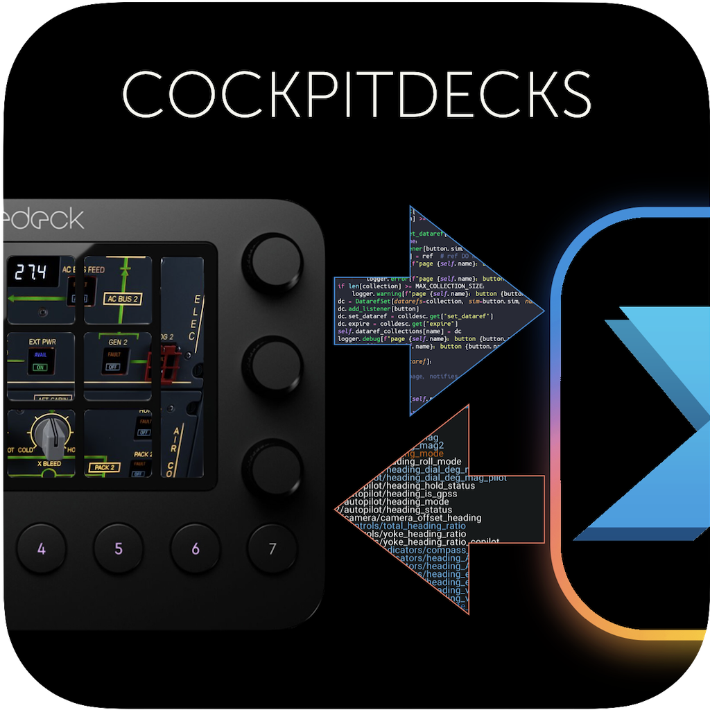

# Welcome to Cockpit Deck

Cockpitdecks is a python software to interface

- Elgato Stream Decks
- Loupedeck LoupedeckLive
- Behringer XTouch Mini

with X-Plane flight simulator.

The project is in active development, perpetual beta software.

Please head to the [documentation](https://devleaks.github.io/cockpitdecks-docs/) for more information.

You can find [numerous configurations for different aircrafts here](https://github.com/dlicudi/cockpitdecks-configs).

